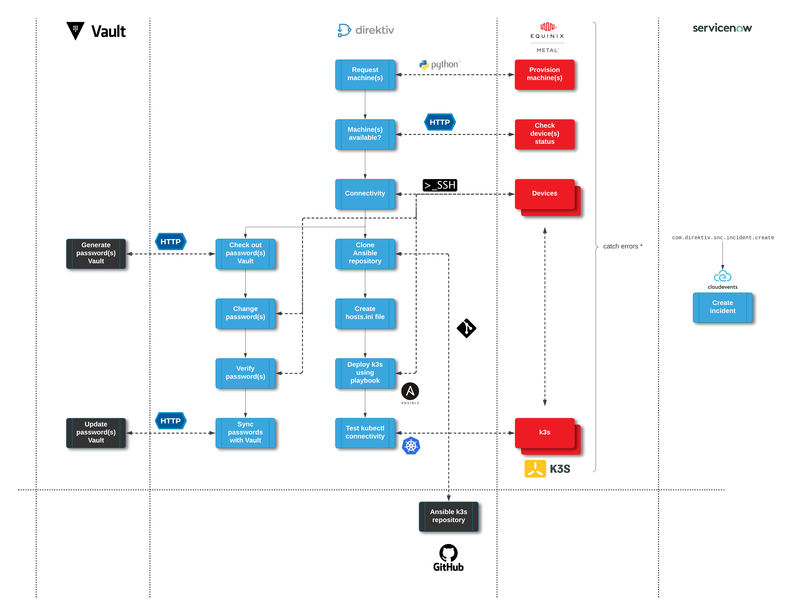
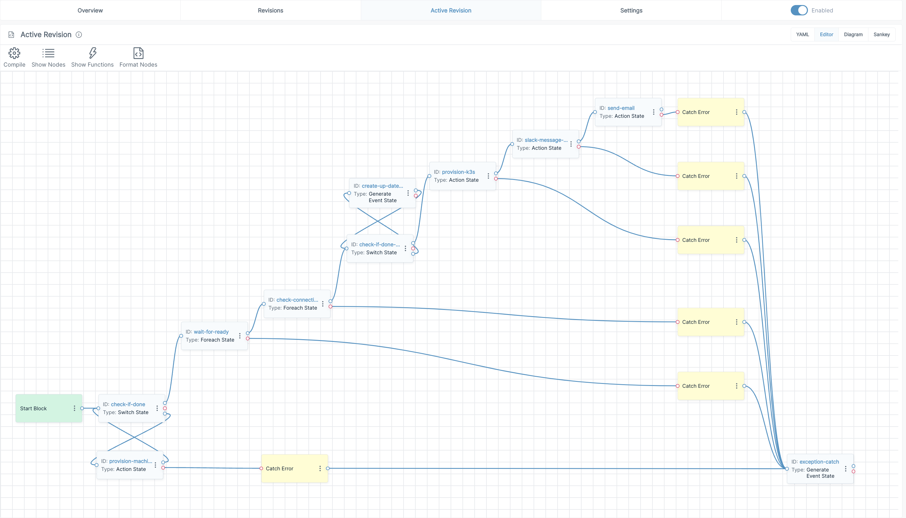

# Sample Equinix Workflows for K3s deployment using Ansible

## Description

The orchestration policy built has the following flow:

1. provision-machines.yaml (starts the provisioning) by taking the input described in the [Input](#input)) section below. The first step of the workflow will provision machines using [Python API](https://deploy.equinix.com/developers/docs/metal/libraries/python/). This code running is in the provision-machines.yaml.metal-python.py Python script and run serverless as a container in Direktiv
2. The next step of the policy will check the status of the machine using the Metal API. The workflow is run as a subflow from the master workflow (called check-machine-status.yaml)
3. Once the machine are confirmed to be up and running, another subflow is used to check SSH connectivity (check-connectivity.yaml)
4. If the machines are all reachable, Direktiv generates a "com.equinix.password.update" event FOR EACH device, which will kick of a workflow ASYNCRHONOUSLY to update the password for the device in HashiCorp Vault (the workflow is called change-passwords.yaml)  
    a. The workflow will use HashiCorp Vault to generate a new password
    b. It will connect to the machine using the old SSH password and update the password
    c. It will check the new password into HashiCorp Vault
5. The subflow (provision-k3s-ansible.yaml) will install EKS on the 3 machines using the Direktiv Ansible container:
    a. It clones the <https://github.com/k3s-io/k3s-ansible.git> repository
    b. Runs the Ansible playbooks in the repository in the Ansible Direktiv container
    c. Get's the "kubeconfig" file created during provisioning
6. Send a Slack message with the "kubeconfig" file
7. Send an email with the results and the "kubeconfig" file

## Input

```json
{
    "projectid": "6b52e3ce-f22f-49d0-ac1c-17db1d323d9a",
    "eqplan": "c3.small.x86",
    "eqmetro": "sv",
    "deviceprefix": "direktiv-eks",
    "devicecount": 3,
    "deviceos": "ubuntu_20_04"
}
```

## Secrets

```bash
EQUINIX_METAL_TOKEN: "The equinix metal token on a org level"
EQUINIX_ID_RSA: "The id_rsa key used to connect to Equinix Metal provisioned machines"
SLACK_URL: "Slack URL to send messages for Slack container"
EMAIL_USER: "Email username (send email)"
EMAIL_PASSWORD: "Email password (send email)"
VAULT_TOKEN: "HashiCorp Vault Token"
VAULT_ADDRESS: "HashiCorp Vault Address"
VAULT_STORE: "HashiCorp Vault Store"
SNC_URL: "ServiceNow URL"
SNC_USER: "ServiceNow Username"
SNC_PASSWORD: "ServiceNow password"
```

## Diagram




